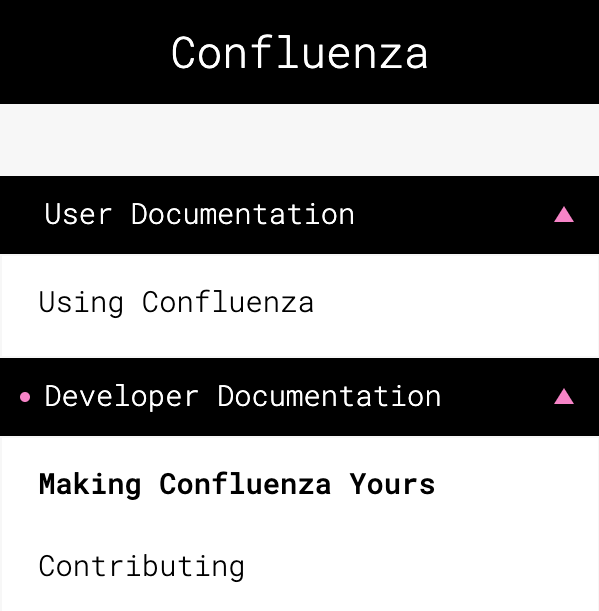

# This top level header will be ignored

Using Confluenza in your own gatsby site is super easy. Here is how.

> Below, we assume that you want to use Confluenza in a Gatsby site that you have in a monorepo in one of your workspaces. We assume that the name of the workspace where you have your Gatsby site to which you want to add Confluenza theme is `homepage`. Confluenza can also be used outside of a monorepo. In such a case, you do not have workspaces though and everything is relative to the root of your Gatsby project. 

## gatsby-theme-confluenza

Add `gatsby-theme-confluenza` to your Gatsby site's `gatsby-config.js`. Like this:

```javascript
module.exports = {
  siteMetadata: {
    title: 'Confluenza',
    editBaseUrl: 'https://github.com/<your-repository-name>/blob/master'
  },
  plugins: [
    '@confluenza/gatsby-theme-confluenza',
    'gatsby-plugin-emotion',
    'gatsby-plugin-catch-links',
    'gatsby-plugin-root-import'
  ]
}
```

## frontmatter and confluenza.yml

Every markdown file that is supposed to be rendered by Confluenza needs to have a so called `frontmatter`
containing important metadata like `title`, `path` and `tag`.

> Markdown files without frontmatter will be ignored by Confluenza unless they serve as the *external content* for other files (see later in this document)

The frontmatter of a Confluenza file normally looks like this:

```yaml
---
path: /users/using-confluenza
title: Using Confluenza
tag: user
---
```

The `path` will become the part of the URL of the page and `title` is self-explaining.
The `tag` field needs a bit more in depth explanation.

## Tags

When confluenza discovers relevant content, it learns the _tag_ corresponding to the given document. Many documents can share the same tag. Let's take the Confluenza navigation menu shown on the picture below.

<a id="figure-1"></a> 
<div class="scrollable flex-wrap responsive">
<div class="bordered-content-300">
  
</div>
</div>
<div class="flex-wrap responsive">
<p class="figure-title"><b>Figure 1</b> Confluenza Navigation Menu</p>
</div>

Here, the _Making Confluenza Yours_ section comes from `01-MakingConfluenzaYours.md` file, while _Contributing_ comes from `02-Contributing.md` file.
The frontmatter of the `01-MakingConfluenzaYours.md` file is the following:

```yaml
---
path: /developers/making-confluenza-yours
title: Making Confluenza Yours
tag: developer
content: ExternalContent.md
---
```

while the frontmatter of the `02-Contributing.md` file is:

```yaml
---
path: /developers/contributing
title: Contributing
tag: developer
content: ../../../../../CONTRIBUTING.md
---
```

Here we see that both documents have the same tag: `developer`. On the other hand, the tag for the document corresponding to Section _Using Confluenza_ is `user`.
You can use any name you like for a tag. Tags simply inform Confluenza that documents with the given tag should be grouped together under one category in the navigation menu. Following our example, the documents tagged `developer` appear under _Developer Documentation_ category, while the documents tagged `user` under _User Documentation_. How does Confluenza know which category title to use for the given tag? This is what `confluenza.yml` file is for.

## confluenza.yml

The `confluenza.yml` file holds associations between tags and the corresponding navigation menu category titles. For instance, in our example, the contents of `confluenza.yml` is the following:

```yaml
- title: 'User Documentation'
  tag: 'user'

- title: 'Developer Documentation'
  tag: 'developer'

- title: 'Other Documents'
  tag: 'other'

- title: 'Demo Workspace 1'
  tag: 'demo1'

- title: 'Demo Workspace 2'
  tag: 'demo2'

- title: 'Packages'
  tag: 'package'
```

We can clearly see which tag receives which title.

### One confluenza.yml is enough

Looking at Confluenza monorepo, you may wonder why there is only one `confluenza.yml` (under `workspaces/homepage`) and still correct navigation headers are rendered even when running `yarn workspace @confluenza/gatsby-theme-confluenza develop` (see more details in Section [gatsby-theme-confluenza](/developers/contributing#gatsby-theme-confluenza) in [Contributing](/developers/contributing)). This is because Confluenza tracks your whole monorepo and so it will find the `confluenza.yml` file even if it is not in the current workspace. This is very convenient as it allows us to keep the Confluenza Gatsby Theme truly content agnostic.

## External content

The frontmatter may also contain an optional field `content` allowing you to refer to the content placed in a separate markdown file.

The `content` field indicates that the intended content of this markdown file is to be found in
another file, as indicated by the value of the `content` field.

For example, the page you are reading now is the external content for
file `01-MakingConfluenzaYours.md` having the following frontmatter:

```yaml
---
path: /developers/making-confluenza-yours
title: Making Confluenza Yours
tag: developer
content: ExternalContent.md
---
```

### How does it actually work
Confluenza is based on [Gatsby](https://www.gatsbyjs.org).
The [gatsby-transformer-remark](https://www.npmjs.com/package/gatsby-transformer-remark) plugin
that is used by Confluenza to process the markdown files, recognizes the `content` field in the `frontmatter`, and if it can resolve the file indicated by its value,
it will process it as a regular markdown file and the result of this processing will be captured in the
`content` field of the corresponding Gatsby node. Below is an example of the remark node corresponding to the `01-MakingConfluenzaYours.md` (the file of which external content you are now reading):

```json
{
  "node": {
    "fileAbsolutePath": "/Users/.../homepage/src/pages/developers/01-MakingConfluenzaYours.md",
    "headings": [
      {
        "value": "More"
      }
    ],
    "frontmatter": {
      "title": "Making Confluenza Yours",
      "path": "/developers/making-confluenza-yours",
      "content": {
        "childMarkdownRemark": {
          "fileAbsolutePath": "/Users/.../homepage/src/pages/developers/ExternalContent.md",
          "headings": [
            {
              "value": "Frontmatter"
            },
            {
              "value": "Tags"
            },
            {
              "value": "External content"
            },
            {
              "value": "When to use the external content?"
            }
          ]
        }
      }
    }
  }
}
```

Now, for each rendered content, Confluenza checks if the `frontmatter` of the corresponding node contains the `content` field. If it does, Confluenza uses the `childMarkdownRemark` to render the page, otherwise it will use the original content. This way, the markdown files with `frontmatter` without the `content` field will be rendered  without any change. If the original file (the one with frontmatter containing the
`content` field) also contains valid markdown, it will be appended to the end of the external content.

> Confluenza will use the title from the frontmatter and will ignore the top-level header in the external content (but currently it requires you to put one).

## When to use the external content?

Whenever you like! But there are some cases where it really helps.

Sometimes you want the content of the markdown file to be rendered in various places. For instance you may
have a monorepo with a workspace corresponding to an npm package. This workspace will most certainly
contain a `README.md` file. You may want to include the content of this file in your Confluenza based
site and still let it be rendered by github or npmjs website.

Now, when rendering the markdown file, Confluenza depends on the so called `frontmatter` containing
important metadata like `title`, `path` and `tag`. These metadata do not have any meaning outside of the
Confluenza environment and therefore should not be kept e.g. in the actual README file of your npm package.
This is not only a cleaner solution (the frontmatter may confuse the reader who is not aware of Confluenza),
but also helps sites that do not render the frontmatter correctly (like npmjs).

## Learn more

Confluenza was initially intended to render static markdown documents in your Gatsby site. But now, you can also use a Confluenza-like navigation in any of your other React-based projects (created with `create-react-app` tool). Please consult the documentation of [@confluenza/component-navigator-react](https://confluenza.online/packages/confluenza-navigator-react) and take a look at a <a href="https://confluenza.online/demo-component-navigator" target="_blank" rel="noopener noreferrer">demo</a>.

<style scoped>
.scrollable {
  width: 100%;
  overflow-x: auto;
}
.flex-wrap {
  display:flex;
  flex-flow:column;
  justify-content:center;
  align-items: center;
}
@media (max-width: 650px) {
  .responsive {
    align-items: flex-start;
  }  
}
.figure-title {
  font-size: 0.8em
}
.bordered-content-600 {
  width: 600px;
  border: 1px solid black;
}
.bordered-content-300 {
  width: 300px;
  border: 1px solid black;
}
</style>
